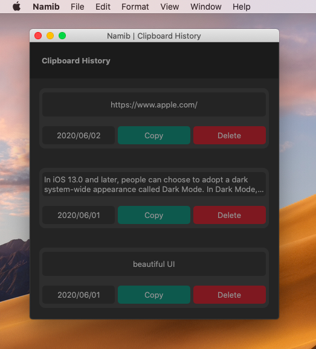

#  Memorian

Clipboard history app for macOS

## Description
This app is for MacOS. It saves your previous copied content into a clean design list. Memorian will automatically detect your shortcut keys (command+c and command+x) in the background, and sync your database and frontend in realtime. You can re-copy the content, delete the content, and check the day you copied the content. This app will help you save multiple copied content temporary, and traceback contents if necessary. Your copied content is saved locally on your computer; hence, there is no worry about information getting fetched.

## Upcomming
- Code refactoring.
- Stable functionality (Unit test implement).
- Support multiple data types (the app doesn't support pdf/svg/png/jpg etc).
- Delete several content at once.
- Clear all copied content with one button.
- Search the clipboard list by keyword/date/type.
- UI color settings

## Installation
1. Use `git clone ` to download the source code.
2. Open the `Memorian.xcodeproj`. It will open Xcode.
3. Check the `Swift Package Manager`. To run the app, `RealmSwift` has to be added to the dependencies. If the package is not added, import `RealmSwift`. On Xcode status bar, go to `file > Swift Packages > Add Package Dependency...`. Copy the RealmSwift github url `https://github.com/realm/realm-cocoa`. Then select both Realm and RealmSwift package.
4. Build the package and Run.

## Contributing
Pull requests are welcome. For major changes, please open an issue first to discuss what you would like to change. I will appreciate if there are any technical/non-technical advice for the app!

## License
[MIT](https://choosealicense.com/licenses/mit/)
